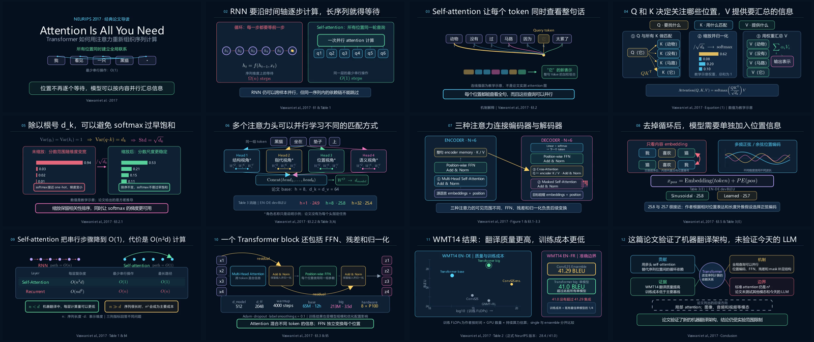

<div align="center">

# build-manim-decks

把论文、报告和课程提纲，制作成经过文本与画面 QA 的 Manim 动态演示文稿。

[](https://github.com/ReaperWLLLLL/build-manim-decks/actions/workflows/ci.yml)
[](LICENSE)
[](https://docs.manim.community/en/stable/)

[效果演示](#效果演示) · [工作流程](#工作流程) · [安装](#安装) · [开始使用](#开始使用) · [输出格式](#输出格式)

</div>


`build-manim-decks` 是一套面向 Codex 的演示文稿制作 Skill，也可以作为独立工具链使用。它把资料梳理、叙事设计、Manim 编排、文字审校、视觉检查和多格式导出放进同一套可复现流程。

它覆盖了普通 Markdown 转换之外的制作环节。每张幻灯片都有可追溯的论点、证据、时长和场景类；样片通过后才进入全稿制作；最终交付前还会检查文本溢出、裁切、空白帧、媒体封装、讲稿映射和重建命令。

## 效果演示

下面的 12 页演示来自一次完整的前向测试：用本 Skill 制作论文 [《Attention Is All You Need》](https://papers.nips.cc/paper_files/paper/2017/hash/3f5ee243547dee91fbd053c1c4a845aa-Abstract.html)的中文导读。动画、结构图和数据图均由 Manim 重新绘制。仓库不分发论文 PDF、论文页面截图或全文提取物。



README 中的 GIF 为加载速度做了压缩。实际项目会分别保留草稿与最终渲染，并为复杂页面抽取首帧、中间帧、最大密度帧和末帧，用于检查动画全过程，而不只检查静态封面。

## 适合什么任务

- 论文导读、研究报告和组会分享
- 学位答辩、项目汇报和技术演讲
- 需要逐步推导、结构变化或信息流动画的课程内容
- 已有 Manim 演示稿的局部返修、视觉 QA 和重新导出
- 需要同时交付离线 HTML、PPTX、PDF 与逐页讲稿的场景

如果你只需要几页静态、原生可编辑的 PowerPoint，这套流程可能过重。它更适合“动画本身承担解释任务”的演示。

## 它具体做什么

| 环节 | 产物或检查 |
|---|---|
| 资料整理 | 从 PDF、Markdown、LaTeX 或提纲建立证据地图；引用使用稳定 ID |
| 叙事设计 | 设计 brief、逐页大纲、动作式标题、时长预算 |
| 规格约束 | 用 `planning/deck.yaml` 统一管理场景、证据、讲稿和输出路径 |
| 文本审校 | 通用 humanizer + 本地语言审校；机械扫描与人工朗读复核分开记录 |
| Manim 制作 | 每个逻辑页对应稳定的 `Slide` 子类；主题、组件和动画语义可复用 |
| 样片门禁 | 先完成代表性页面，让用户确认叙事密度、字体、配色和动效 |
| 视觉 QA | 抽帧、总览图、边界与密度检查，再进行全分辨率人工复核 |
| 多格式导出 | 单文件离线 HTML、视频型 PPTX、静态 PDF、定时讲稿 |
| 交付验证 | 检查媒体、海报帧、备注、页数、比例、引用、审批状态和重建命令 |
| 发布检查 | 私有化第三方全文和原始文档，保留许可证与第三方说明 |

## 工作流程


默认有两个需要用户确认的节点：大纲和代表性样片。用户明确要求自主执行时，可以跳过等待，但设计 brief、大纲、规格文件和 QA 证据仍会保留。

完整规则见 [SKILL.md](SKILL.md) 和 [工作流说明](references/workflow.md)。

## 输出格式

| 格式 | 用途 | 实现方式与边界 |
|---|---|---|
| `presentation.html` | 浏览器演示、离线分享 | 视频以 data URI 嵌入单个 HTML；带键盘导航、进度、全屏和讲者备注，不依赖 CDN |
| `presentation.pptx` | PowerPoint、Keynote 或 LibreOffice 演示 | 每页嵌入 Manim 视频，并放置唯一海报帧和静态后备图；含逐页备注，但 Manim 对象不是原生可编辑形状 |
| `presentation.pdf` | 归档、审阅和打印 | 每页选取一个有代表性的稳定帧，保持 16:9 版式 |
| `speech.md` | 排练和现场讲述 | 按页记录目标时长、口播稿、翻页提示和证据 ID |

PowerPoint、Keynote、LibreOffice 和浏览器对媒体自动播放的处理并不完全相同。发布前应在实际演示设备上再走一遍。

## 安装

### 1. 准备运行环境

建议使用 Python 3.10 或更高版本，并创建独立虚拟环境。Manim 还需要 Cairo、Pango、FFmpeg 等系统组件；需要公式排版时再安装 LaTeX。不同系统的准备方式请以 [Manim CE 官方安装文档](https://docs.manim.community/en/stable/installation.html) 为准。

本仓库使用 Manim Community Edition 和 Manim Slides。若要使用 Manim Slides 的本地演示窗口，还需按其 [安装说明](https://manim-slides.eertmans.be/latest/installation.html) 选择 Qt 后端；仅渲染和导出时通常不需要该窗口。

### 2. 安装 Skill

将仓库克隆到 Codex 的 Skill 目录。默认目录通常是 `~/.codex/skills`；如果你设置了其他 `CODEX_HOME`，请相应替换。

```bash
mkdir -p ~/.codex/skills
git clone https://github.com/ReaperWLLLLL/build-manim-decks.git \
  ~/.codex/skills/build-manim-decks
cd ~/.codex/skills/build-manim-decks
```

创建虚拟环境并安装 Python 依赖：

```bash
python3.11 -m venv .venv
source .venv/bin/activate
python -m pip install --upgrade pip
python -m pip install -r requirements.txt
```

Windows PowerShell 激活命令为：

```powershell
.venv\Scripts\Activate.ps1
```

### 3. 运行环境检查

下面的检查覆盖 PDF 输入、LaTeX 公式和 PPTX 输出所需组件：

```bash
python scripts/preflight.py \
  --need-pdf-input \
  --need-latex \
  --need-pptx
```

如果项目不含公式，可去掉 `--need-latex`。如果输入不是 PDF，也可以去掉 `--need-pdf-input`。

## 开始使用

### 在 Codex 中使用

把资料放在一个独立项目目录中，然后在 Codex 对话里明确受众、时长、语言、输出格式和审批方式。例如：

```text
使用 $build-manim-decks，把 source/paper.pdf 做成一场 12 分钟的中文论文导读。

受众是了解深度学习基础的研究生。请输出离线 HTML、PPTX、PDF 和逐页讲稿。
先和我确认设计 brief 与大纲，再做两页代表性样片；样片批准后再完成全稿。
所有数字、公式和结论都要关联到 evidence-map，不要使用论文页面截图。
```

Skill 会按 QA 节点推进，而不是一次性生成所有页面。修改意见最好指向页 ID，例如“把 `s04` 的 Q–K–V 区域放大，并缩短底部结论”，这样只需重渲染受影响的场景。

### 用脚本建立项目

如果你想先手动创建目录，可以直接运行脚手架。演示项目应放在 Skill 仓库之外。

```bash
export SKILL_DIR="$HOME/.codex/skills/build-manim-decks"

python "$SKILL_DIR/scripts/scaffold_project.py" \
  ./my-research-talk \
  --title "My Research Talk"
```

脚手架会创建以下结构：

```text
my-research-talk/
├── .private/                 # 第三方原文与全文提取物；默认不进入版本库
├── source/                   # 可公开的自有资料、提纲或引用记录
├── planning/
│   ├── design-brief.md
│   ├── evidence-map.md
│   ├── outline.md
│   └── deck.yaml
├── src/                      # Manim 主题、组件与场景代码
├── build/                    # 草稿和最终渲染缓存
├── qa/                       # 文本复核、抽帧、总览图与修复记录
└── deliverables/
    ├── presentation.html
    ├── presentation.pptx
    ├── presentation.pdf
    ├── speech.md
    └── rebuild.md
```

脚本负责确定性的校验、渲染、抽帧和导出。`src/` 中的场景仍由 Codex 按叙事和视觉目标编写，不是固定模板的简单套用。

## 常用命令

在 `deck.yaml` 已经完成并通过审阅后，可以手动执行这些命令：

```bash
# 校验叙事、时长、证据和路径
python "$SKILL_DIR/scripts/validate_deck.py" \
  ./my-research-talk/planning/deck.yaml \
  --check-paths

# 生成文本审校报告
python "$SKILL_DIR/scripts/audit_text.py" \
  ./my-research-talk/planning/deck.yaml

# 只渲染 s04 的草稿，并刷新 HTML 与讲稿
python "$SKILL_DIR/scripts/render_deck.py" \
  ./my-research-talk/planning/deck.yaml \
  --profile draft \
  --slides s04 \
  --outputs html,speech

# 为草稿抽帧并生成总览图
python "$SKILL_DIR/scripts/visual_qa.py" \
  ./my-research-talk/planning/deck.yaml \
  --profile draft

# 最终渲染四种交付物
python "$SKILL_DIR/scripts/render_deck.py" \
  ./my-research-talk/planning/deck.yaml \
  --profile final \
  --outputs html,pptx,pdf,speech

# 终检
python "$SKILL_DIR/scripts/verify_outputs.py" \
  ./my-research-talk/planning/deck.yaml
```

需要先查看底层命令而不实际渲染时，给 `render_deck.py` 加上 `--dry-run`。

## QA 重点

自动检查适合发现可计算的问题，不能替代人眼判断。最终审核至少覆盖以下内容：

- 标题、标签和公式是否越过形状边界或画面安全区
- 动画中间态是否发生遮挡、裁切、闪烁或信息堆叠
- 引用、数字、单位、公式与 evidence map 是否一致
- PPTX 是否有非空海报帧、静态后备图、自动播放设置和讲者备注
- PDF 页数、16:9 尺寸和代表帧是否正确
- HTML 是否单文件离线可用，是否存在远程脚本、字体或媒体依赖
- 讲稿页序、总时长和翻页提示是否与演示稿一致

详细标准见 [视觉 QA](references/visual-qa.md) 与 [输出契约](references/output-contract.md)。

## 版权与发布边界

仓库源码采用 [MIT License](LICENSE)。Manim、Manim Slides、pypdf、FFmpeg 等依赖继续适用各自许可证，详见 [THIRD_PARTY_NOTICES.md](THIRD_PARTY_NOTICES.md)。

本 Skill 默认把第三方 PDF、全文提取物和页面渲染放进 `.private/`，公开项目只保留书目信息、官方链接、定位信息、独立撰写的摘要和带出处的解释性重绘。仓库也不会打包微软雅黑等专有字体文件、FFmpeg 二进制或 Python 虚拟环境。发布二进制安装包或容器时，需要重新盘点实际捆绑的全部依赖。

关于输入材料和示例项目的发布规则，见 [许可与发布说明](references/licensing-and-publication.md)。

## 开发与贡献

安装开发依赖并运行测试：

```bash
python -m pip install -r requirements-dev.txt
python -m pytest -q
```

欢迎提交问题和 Pull Request。涉及渲染或版式的改动，请附上最小复现用的 `deck.yaml`、受影响的页 ID，以及修复前后的 QA 帧；不要把无权再分发的论文原文、字体或其他第三方素材提交到仓库。

## 致谢

本项目建立在 [Manim Community Edition](https://github.com/ManimCommunity/manim) 与 [Manim Slides](https://github.com/jeertmans/manim-slides) 之上。文字复核流程参考了 Humanizer、Humanizer-zh 与 Stop Slop 的公开方法，但规则和实现均在本仓库中独立编写，未复制或捆绑上游 Skill 文件。
